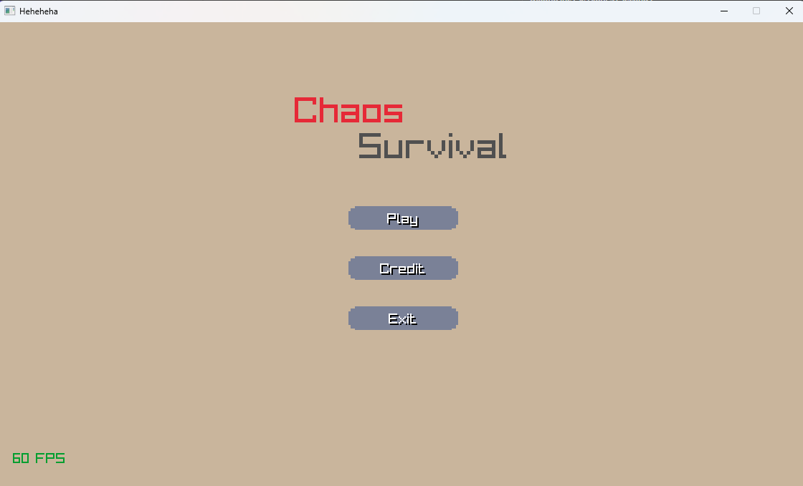
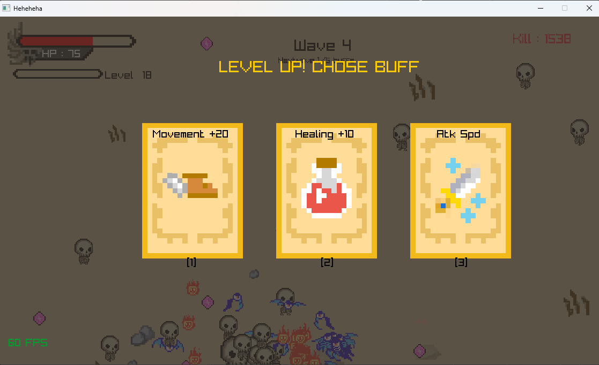
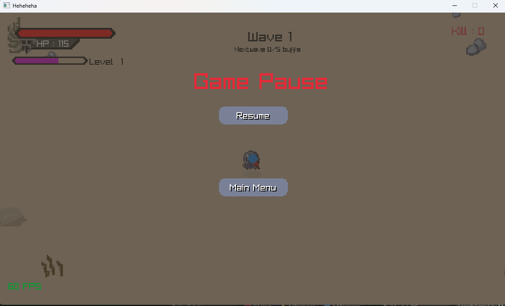
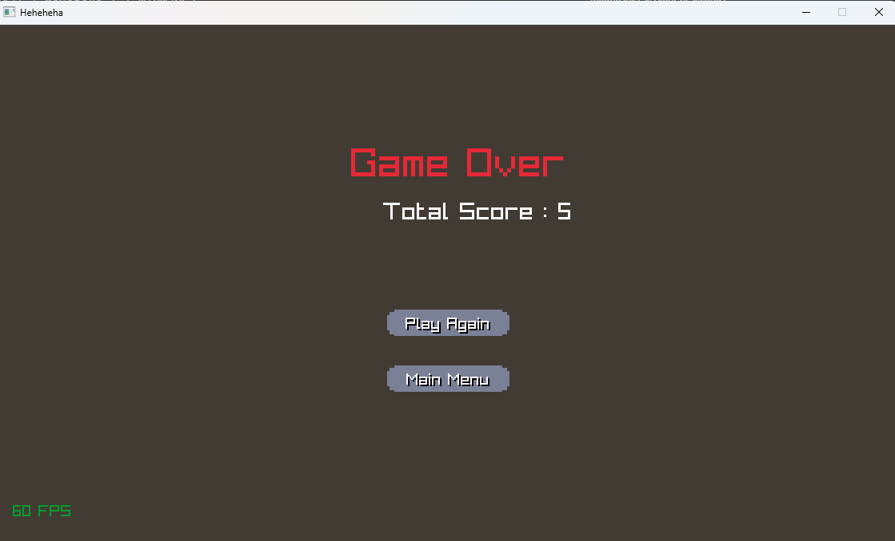

# ⚔️ ChaosSurvival

# ini game apa sih?

**ChaosSurvival** adalah game action RPG 2D yang dibuat menggunakan C++ dan Raylib.
secara garis besar game nya seperti ini  :nada player, enemy, projectile dan itu semua saling berinteraksi.
player spawn di tengah wordl, lalu para enemy(musuh) datang secara terus meneurus seusai wave(gelombang level)
di sini projectile otomatis keluar dari player jadi player atau pemain hanya perlu mengerakan player menghindari musush.
nnah jika player mebunuh enemy, maka enemy akan drop xp/gem dan itu digunakan untuk menaikan level.
setiap player naik level,\nplayer akan memlih buff acak bejumlah 3 pilihan,
dan akan terus acak sesuai dengan level player,
semakin banyak buff semakain kuat player melawan enemy yang semaikn kuat di setiap wave atau gelobangnya
Project ini dikerjakan oleh kami sebagai tugas akhir/proyek Algorima Pemrograman.:)

# Tentang Project 
* Project ini belum selesai! mungkin akan di update kedepanya:)
* Project ini mengunakan raylib 5.5
* Mengguankan build system cmake
* ditulis mengunakan c++

# Gamplay(unfinished)

## 👥 Anggota Tim
* **Ketua:** M Ma'sum Hadi 25.11.6451
* **Artist:** Wistara Panggih Arifin 25.11.6454 dan Dzaki Hafidz A 25.11.6465
* **Sound:** Rifky Aditya R 25.11.6481 
* **Enginer:** Rafa Adib Prabowo 25.11.6484

## 🚀 Cara Menjalankan Project

Project ini menggunakan **Cmake** dan **raylib**!

## 📋 Prasyarat 
Pastikan kamu sudah menginstall ini:
* **Git**
* **C++ Compiler** (MSVC untuk Windows, Clang/GCC untuk Mac/Linux)
* **CMake** 

---

### 🚀 Menggunakan Visual Studio 

1.  Copy repository github : `https://github.com/Rafaadib/ChaosSurvival.git`
2.  Buka **Visual Studio 2022**.
3.  Pilih menu **"Open a Local Folder"**.
4.  Pilih folder `ChaosKnight` (folder terluar yang ada file `CMakeLists.txt`).
5.  Tunggu sebentar saat Visual Studio menyiapkan CMake (Lihat bar di bawah: *"Preparing CMake..."*). Ini akan mendownload Raylib secara otomatis.
6.  Setelah selesai, pastikan **Startup Item** (tombol Play hijau di atas) terpilih **`ChaosKnight.exe`**.
7.  Tekan **F5** untuk Run.

---

### 💻 Menggunakan VS Code (Mac / Windows / Linux)

**Clone Repository (Jika belum punya file project)**
1.  Buka VS Code.
2.  Tekan tombol kombinasi untuk membuka Command Palette:
    * **Windows:** `Ctrl + Shift + P`
    * **Mac:** `Cmd + Shift + P`
3.  Ketik **`Git: Clone`** lalu tekan Enter.
4.  Masukkan URL Repository GitHub ini dan tekan Enter.
5.  Copy repository github : `https://github.com/Rafaadib/ChaosSurvival.git`
6.  Pilih folder di komputermu untuk menyimpan project.
7.  Setelah selesai, klik tombol **Open** pada notifikasi yang muncul di pojok kanan bawah.

**install ini jika belum**
    Install Ekstensi di VS Code:
    * **C/C++** (by Microsoft)
    * **CMake Tools** (by Microsoft)

8.  Buka VS Code, lalu pilih **File > Open Folder...**
9.  Pilih folder project `ChaosKnight`.
10.  Pilih "Select a Kit" (Pilih Compiler):
    * **Mac:** Pilih **Clang** atau **GCC**.
    * **Windows:** Pilih **Visual Studio Community Release**.
11.  Lihat **Status Bar** (Baris paling bawah VS Code warna biru):
    * Klik ikon **Build** (Gerigi) untuk compile.
    * Klik ikon **Play** (Segitiga) untuk menjalankan game.

---

### ⚠️  Penting wak!
* Jika aset (gambar/suara) tidak muncul, coba **Save ulang file `CMakeLists.txt`** untuk memicu copy aset ke folder build.
* nyusul

## 🎮 Kontrol Game
* **W / A / S / D dan Arrow key**: Bergerak
* **ALT** : FullScreen bisa tapi rada burik hehe

## 📂 Struktur Folder
* `Src/` : Source code utama.
* `GameAsset/` : Tempat gambar dan sprite.
* `Sound/` : Tempat efek suara dan musik.

---
* **Tim Ambatron**